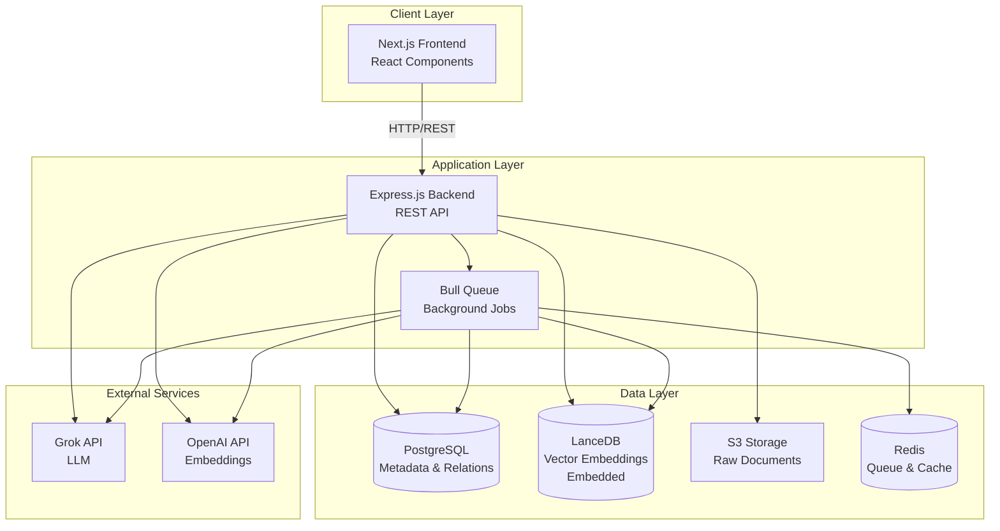
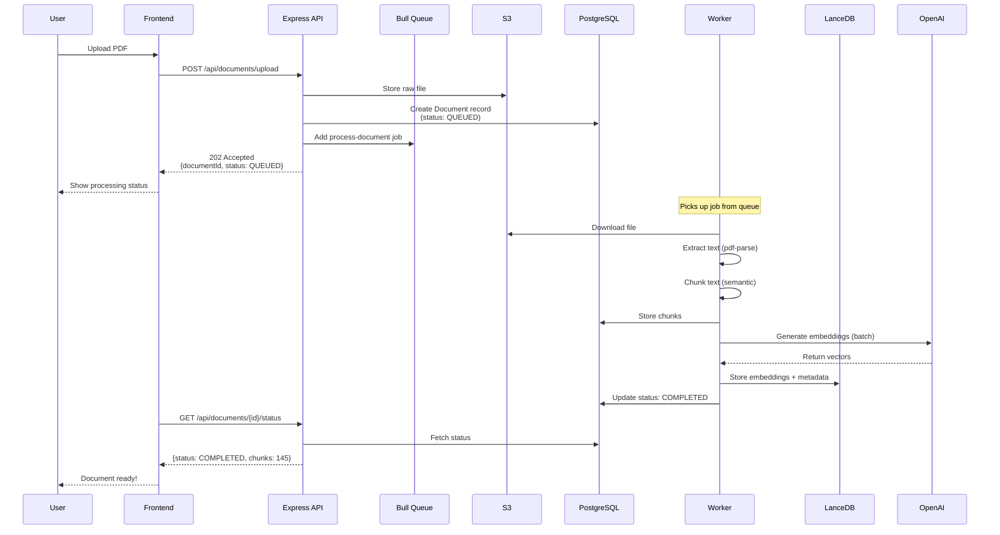
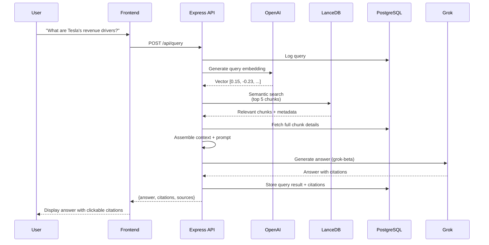
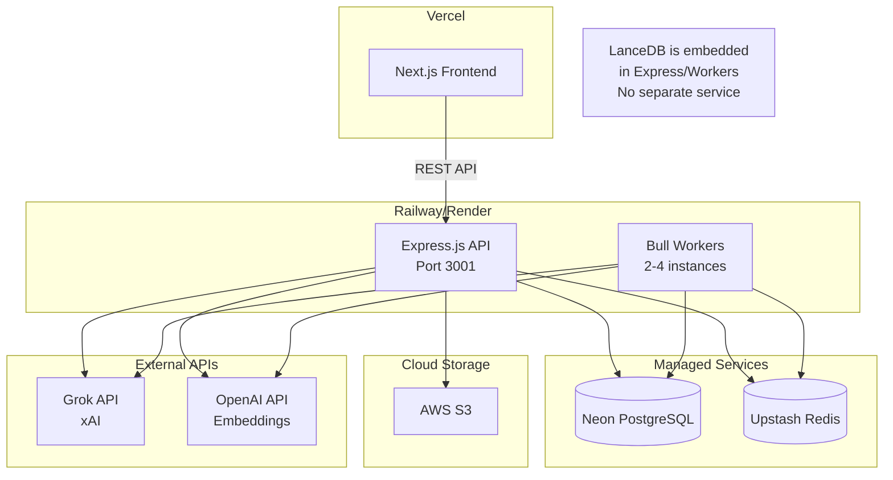
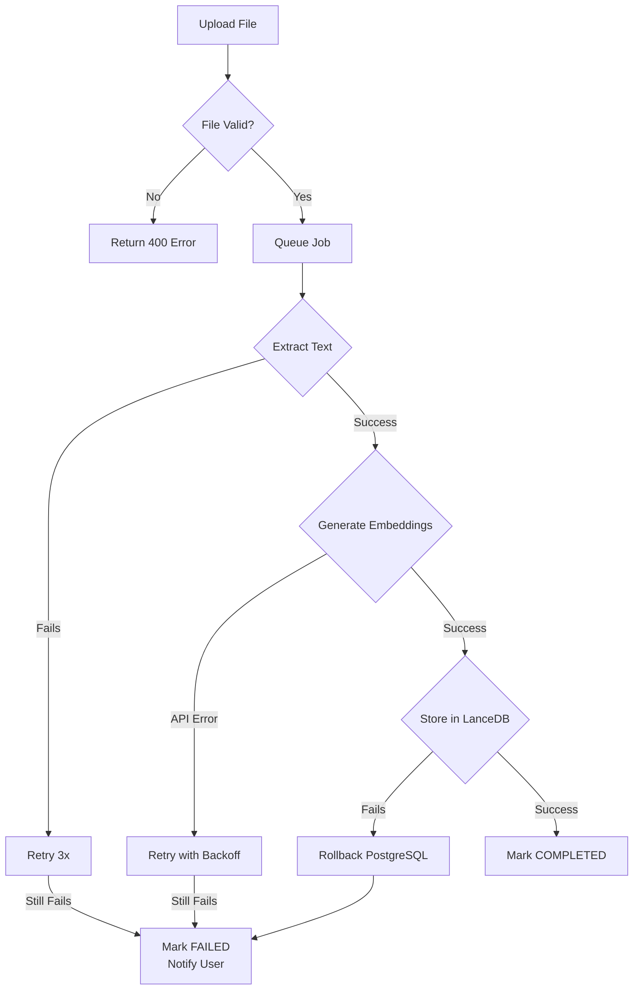

# RAG Investment Analyzer - System Architecture

## Tech Stack

**Frontend:** Next.js 14+ (React, TypeScript)
**Backend:** Express.js (Node.js, TypeScript)
**ORM:** Prisma
**Database:** PostgreSQL
**Vector Database:** LanceDB (Embedded)
**LLM:** Grok (xAI) + OpenAI (embeddings only)
**File Storage:** Local/AWS S3
**Job Queue:** Bull (Redis-based)

---

## High-Level Architecture



### Why Separate Backend?

- **No Timeout Limits:** Document processing takes 40-65 seconds (Vercel has 10s limit)
- **Background Jobs:** Bull queue handles long-running tasks asynchronously
- **Scalability:** Backend can scale independently from frontend
- **Better Control:** Full control over processing pipeline and resources

---

## System Components

### Frontend (Next.js)
- **Purpose:** User interface only (no API routes)
- **Responsibilities:**
  - Render UI components
  - Make API calls to Express backend
  - Display results and documents
- **Deployment:** Vercel
- **Structure:**
  ```
  /app
    /page.tsx                 # Query interface
    /documents/page.tsx       # Document list
    /components               # React components
    /lib/api-client.ts        # Backend API client
  ```

### Backend (Express.js)
- **Purpose:** REST API server
- **Responsibilities:**
  - Handle file uploads
  - Queue document processing jobs
  - Process queries (embedding + search + LLM)
  - Manage database operations
- **Deployment:** Railway, Render, or AWS
- **Port:** 3001
- **Structure:**
  ```
  /src
    /routes                   # API endpoints
    /services                 # Business logic
    /jobs                     # Background job workers
    /middleware               # Auth, validation, error handling
    /config                   # Configuration
  ```

### Background Jobs (Bull Queue)
- **Purpose:** Asynchronous document processing
- **Why Needed:** Processing takes too long for HTTP requests
- **Jobs:**
  1. `process-document` - Extract text, chunk, embed, store
  2. `cleanup-failed` - Retry or clean up failed documents
- **Workers:** 2-4 concurrent workers

### PostgreSQL
- **Purpose:** Metadata storage and relationships
- **Stores:**
  - Documents, Companies, Chunks (text only)
  - Queries, Results, Citations
  - User data, Processing status
- **Access:** Via Prisma ORM

### LanceDB
- **Purpose:** Vector similarity search
- **Stores:**
  - Embeddings (1536-dimensional vectors)
  - Metadata (company, document type, etc.)
  - Chunk text (duplicated for quick retrieval)
- **Deployment:** Embedded (no separate server needed)
- **Advantages:** Simpler deployment, no Docker, lower latency

### Redis
- **Purpose:** Job queue and caching
- **Uses:**
  - Bull queue storage
  - Cache frequent query results
  - Rate limiting

---

## Document Ingestion Flow



### Steps Breakdown

1. **Upload (< 1s):** Store file in S3, create DB record, queue job
2. **Extract (5-10s):** Parse PDF, extract text and metadata
3. **Chunk (2-3s):** Split into 512-1024 token chunks with overlap
4. **Embed (30-45s):** Generate vectors via OpenAI (batched)
5. **Store (1-2s):** Save to LanceDB with metadata (embedded, faster)
6. **Complete:** Update PostgreSQL status

**Total Time:** 40-60 seconds (runs in background)

---

## Query Processing Flow



### Performance

- **Query Embedding:** 200ms
- **LanceDB Search:** 20-50ms (embedded, lower latency)
- **PostgreSQL Fetch:** 10-20ms
- **LLM Generation (Grok):** 2-3 seconds
- **Total:** ~2.5-3 seconds end-to-end

---

## API Endpoints

### Documents
```
POST   /api/documents/upload         Upload document (returns job ID)
GET    /api/documents                List all documents
GET    /api/documents/:id            Get document details
GET    /api/documents/:id/status     Get processing status
DELETE /api/documents/:id            Delete document
```

### Queries
```
POST   /api/query                    Submit query
GET    /api/queries                  List query history
GET    /api/queries/:id              Get specific query result
```

### Companies
```
GET    /api/companies                List all companies
GET    /api/companies/:ticker        Get company documents
```

---

## Database Schema (Key Models)

```typescript
// Prisma Schema Highlights

model Document {
  id              String          @id @default(uuid())
  filename        String
  fileUrl         String          // S3 URL
  status          DocumentStatus  // QUEUED, PROCESSING, COMPLETED, FAILED
  documentType    DocumentType    // FILING_10K, FILING_10Q, etc.

  companyId       String
  company         Company         @relation(...)

  chunksCount     Int             @default(0)
  processingError String?

  chunks          DocumentChunk[]
  citations       Citation[]
}

model DocumentChunk {
  id              String      @id @default(uuid())
  documentId      String
  text            String      @db.Text
  chunkIndex      Int
  pageNumber      Int?
  section         String?

  lanceId         String      @unique    // Links to LanceDB
  embeddingStored Boolean     @default(false)
}

model Query {
  id              String        @id @default(uuid())
  queryText       String        @db.Text
  companyFilter   String?
  documentTypes   String[]
  result          QueryResult?
}

model QueryResult {
  id                String      @id @default(uuid())
  answer            String      @db.Text
  processingTimeMs  Int
  citations         Citation[]
}
```

**Full schema:** See `/Docs/architecture-diagrams.md`

---

## LanceDB Structure

```typescript
// Table: "investment_documents"

{
  id: "chunk_uuid_123",
  text: "Tesla's revenue for fiscal year 2023...",
  vector: [0.123, -0.456, 0.789, ...],  // 1536 dims
  documentId: "doc_uuid_456",
  documentName: "Tesla_10K_2023.pdf",
  companyId: "company_uuid",
  companyTicker: "TSLA",
  documentType: "FILING_10K",
  fiscalYear: 2023,
  pageNumber: 45,
  section: "Management Discussion & Analysis",
  chunkIndex: 12
}

// Query Example (using LanceDB)
const results = await table
  .vectorSearch(queryVector)
  .limit(5)
  .where("companyTicker = 'TSLA' AND documentType = 'FILING_10K'")
  .toArray();
```

---

## Data Synchronization Strategy

### Challenge
Data lives in two places: PostgreSQL (metadata) and LanceDB (vectors). Must stay in sync.

### Solution: Transaction-like Pattern

```typescript
async function storeDocumentChunks(chunks: Chunk[]) {
  // Wrap in Prisma transaction
  await prisma.$transaction(async (tx) => {
    // 1. Store in PostgreSQL
    await tx.documentChunk.createMany({ data: chunks })

    // 2. Store in LanceDB
    try {
      const lanceData = chunks.map(c => ({
        id: c.id,
        text: c.text,
        vector: c.embedding,
        ...c.metadata
      }));

      await lanceTable.add(lanceData)

      // 3. Mark as synced
      await tx.documentChunk.updateMany({
        where: { id: { in: chunks.map(c => c.id) } },
        data: { embeddingStored: true }
      })
    } catch (error) {
      // Rollback: Prisma transaction auto-rollbacks
      throw new Error('LanceDB storage failed')
    }
  })
}
```

### Cleanup Job
Periodic background job verifies consistency and fixes orphaned records.

---

## Deployment Architecture



### Infrastructure Costs (Production)

| Service | Provider | Cost/Month |
|---------|----------|------------|
| Frontend | Vercel Pro | $20 |
| Backend | Railway | $20 |
| PostgreSQL | Neon Scale | $20-50 |
| LanceDB | Embedded (Free) | $0 |
| Redis | Upstash | $10 |
| S3 Storage | AWS | $5-10 |
| Grok API | xAI (Usage-based) | $30-100 |
| OpenAI API | Embeddings only | $20-50 |
| **Total** | | **$125-260** |

**Cost Savings:** LanceDB being embedded saves ~$20/month compared to hosted ChromaDB.

---

## Error Handling

### Document Processing Failures



### Query Processing Failures

- **Empty Query:** Return 400 with validation message
- **No Results:** Return empty result with suggestion
- **LLM Timeout:** Return 504, offer retry
- **Low Confidence:** Include disclaimer in response

---

## Project Structure

```
rag-investment-analyzer/
├── frontend/                 # Next.js application
│   ├── app/
│   ├── components/
│   └── lib/api-client.ts    # Backend API calls
│
├── backend/                  # Express.js application
│   ├── src/
│   │   ├── routes/          # API endpoints
│   │   │   ├── documents.ts
│   │   │   ├── queries.ts
│   │   │   └── companies.ts
│   │   ├── services/        # Business logic
│   │   │   ├── documentService.ts
│   │   │   ├── embeddingService.ts
│   │   │   ├── vectorStoreService.ts
│   │   │   ├── llmService.ts
│   │   │   └── ragPipeline.ts
│   │   ├── jobs/            # Bull job processors
│   │   │   └── processDocument.ts
│   │   ├── middleware/      # Auth, validation, errors
│   │   ├── config/          # Configuration
│   │   └── server.ts        # Express app entry
│   └── prisma/
│       └── schema.prisma
│
└── docs/                    # Documentation
```

---

## Key Design Decisions

### 1. Why Express over Next.js API Routes?
- No 10-second timeout limit
- Better for long-running tasks
- Independent scaling
- Background job support

### 2. Why Bull Queue?
- Reliable job processing
- Retry logic built-in
- Job progress tracking
- Scales with Redis

### 3. Why Dual Storage (PostgreSQL + LanceDB)?
- PostgreSQL: Relations, transactions, metadata queries
- LanceDB: Fast embedded vector similarity search
- Best tool for each job
- LanceDB advantage: No separate server, lower latency

### 4. Why Prisma?
- Type-safe database access
- Automatic migrations
- Excellent TypeScript integration
- Good developer experience

---

## Development Workflow

### Local Setup
```bash
# Backend
cd backend
npm install
npx prisma migrate dev
npm run dev              # Port 3001

# Frontend
cd frontend
npm install
npm run dev              # Port 3000

# Redis (Docker or local)
docker run -p 6379:6379 redis
# Or: brew install redis && redis-server

# PostgreSQL (local)
brew install postgresql
createdb rag_investment_db
```

### Environment Variables
```bash
# Backend .env
DATABASE_URL=postgresql://user@localhost:5432/rag_investment_db
LANCEDB_PATH=./lancedb_data
REDIS_URL=redis://localhost:6379
GROK_API_KEY=xai-...
OPENAI_API_KEY=sk-...        # For embeddings only
AWS_S3_BUCKET=...             # Optional
FRONTEND_URL=http://localhost:3000

# Frontend .env
NEXT_PUBLIC_API_URL=http://localhost:3001
```

---

## Next Steps

1. **Phase 1:** Set up Express backend with basic CRUD
2. **Phase 2:** Implement document processing pipeline
3. **Phase 3:** Build query processing with RAG
4. **Phase 4:** Create Next.js frontend UI
5. **Phase 5:** Deploy to production

See `/Docs/vision.md` for full implementation roadmap.
